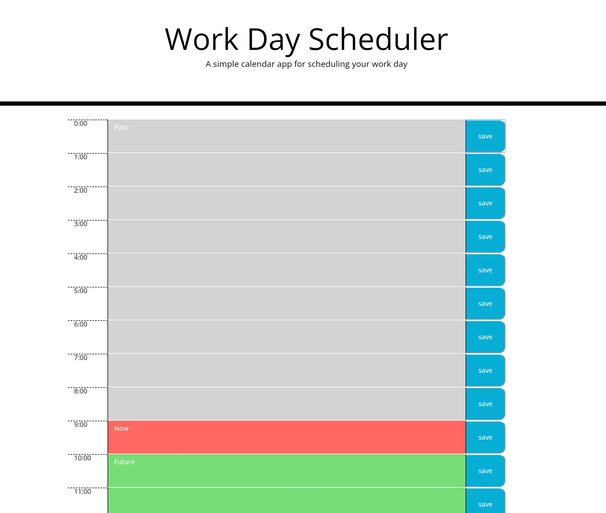

# Work-Day-Scheduler

Work Day Scheduler let user puts notes on time slot and saves to the local storage. Schedule display in a 24 hour time table format. Colors on textbox help user to track current, past, and future tasks. Grey means past. Red means present. Green means future. 

One of the challenge in this project is to avoid replicating same codes wth different id since we want the note save on the time table when user click on the save button on the same row. The "HasClass" method helps to solve this issue. I can use a loop to assign unique class name when appending each row into HTML and use the "HasClass" method to track which button has clicked.

## Built With
* HTML
* CSS
* Javascript

## Website
https://maggie9685.github.io/Work-Day-Scheduler/

## License
Licensed under the MIT license.
